# Architecture & Diagrams

> Visual companion to `SOURCE_OF_TRUTH.md`. Diagrams use **Mermaid** so they stay as text
> (version-controlled, editable). View with any Markdown preview that supports Mermaid (Kiro/VS Code do).
> Last updated: 2026-06-18

## Table of Contents
1. [High-Level System Architecture](#1-high-level-system-architecture)
2. [Multi-Tenancy Model](#2-multi-tenancy-model)
3. [Backend Module / Service Map](#3-backend-module--service-map)
4. [Database ER Diagram (core)](#4-database-er-diagram-core)
5. [Order Lifecycle (sequence)](#5-order-lifecycle-sequence)
6. [Reservation Flow (sequence)](#6-reservation-flow-sequence)
7. [Authentication & RBAC Flow](#7-authentication--rbac-flow)
8. [Offline-First POS Sync](#8-offline-first-pos-sync)
9. [Deployment / Infrastructure](#9-deployment--infrastructure)
10. [Mobile Evolution Path](#10-mobile-evolution-path)
11. [Roadmap Timeline (Gantt)](#11-roadmap-timeline-gantt)
12. [Tenant Onboarding State Machine](#12-tenant-onboarding-state-machine)

---

## 1. High-Level System Architecture

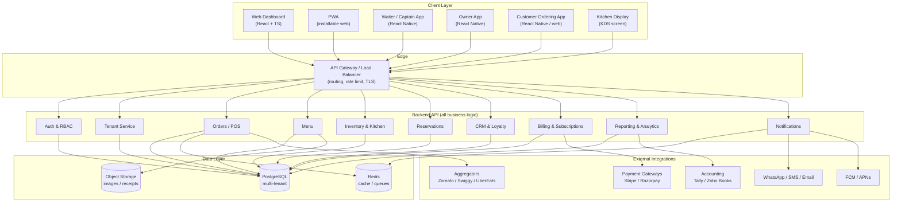

---

## 2. Multi-Tenancy Model

Two common strategies. Recommended start: **shared DB + tenant_id** (simplest to scale for many small tenants),
with the option to promote large/enterprise clients to a dedicated database later.

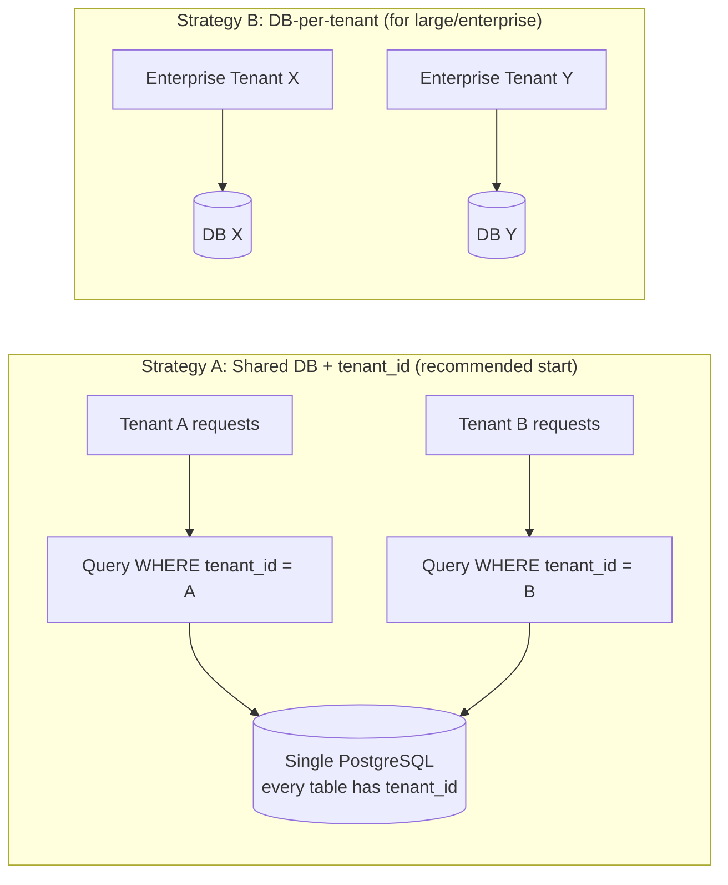

Key rules:
- Every tenant-scoped table carries `tenant_id`.
- Enforce isolation at the data-access layer (and ideally Postgres Row-Level Security) so no query can leak across tenants.
- A `super_admin` (platform owner) operates above tenants.

---

## 3. Backend Module / Service Map

Start as a **modular monolith** (one deployable, clean module boundaries), split into microservices only if scale demands.

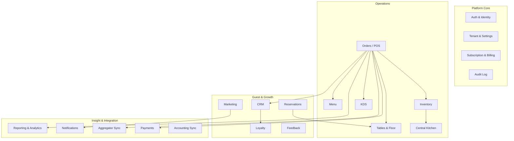

---

## 4. Database ER Diagram (core)

Simplified core entities. Every tenant-scoped table includes `tenant_id` (shown on key tables).

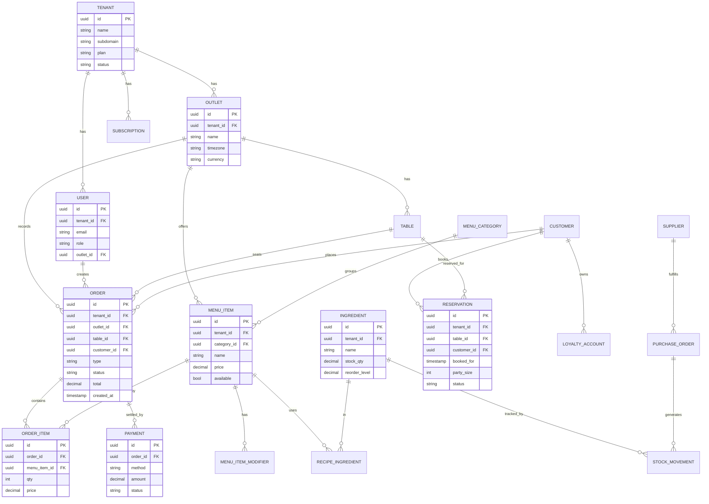

---

## 5. Order Lifecycle (sequence)

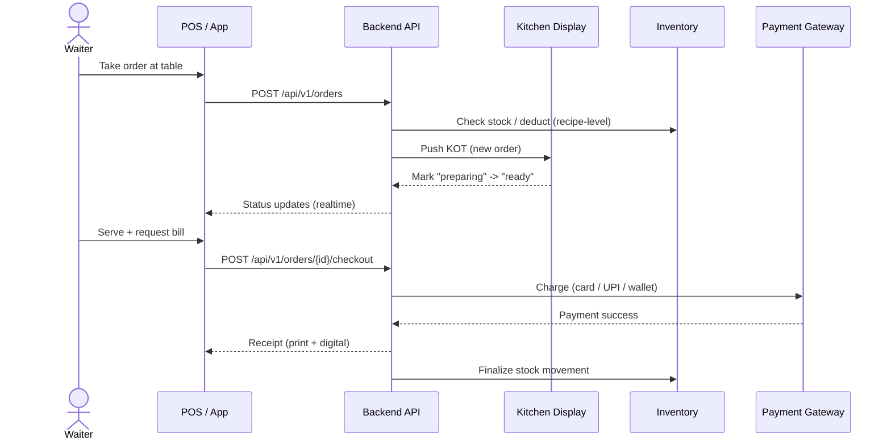

---

## 6. Reservation Flow (sequence)

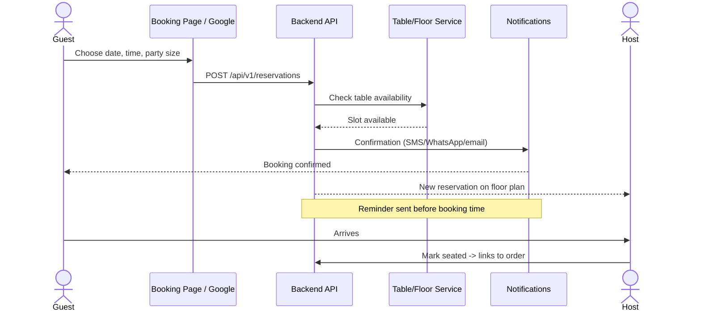

---

## 7. Authentication & RBAC Flow

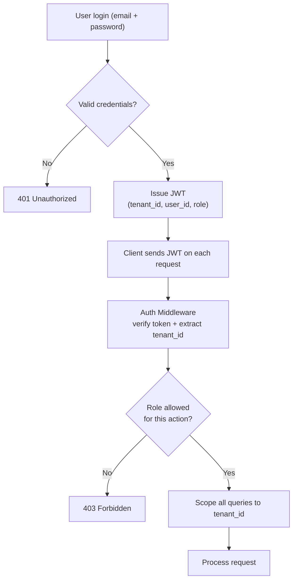

Roles (per tenant): `super_admin` (platform), `owner`, `manager`, `cashier`, `waiter`, `kitchen`, `accountant`.

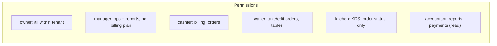

---

## 8. Offline-First POS Sync

POS must keep working when internet drops, then reconcile.

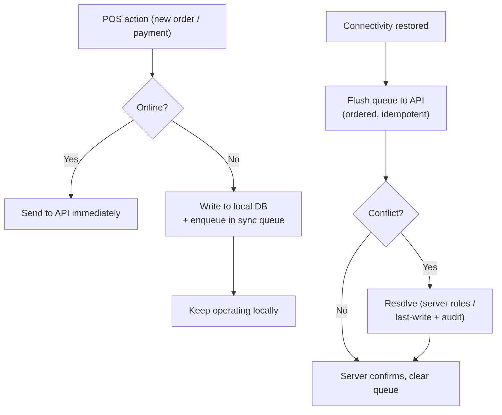

Design notes: use idempotency keys per action, server-authoritative IDs, and an audit trail for conflict resolution.

---

## 9. Deployment / Infrastructure

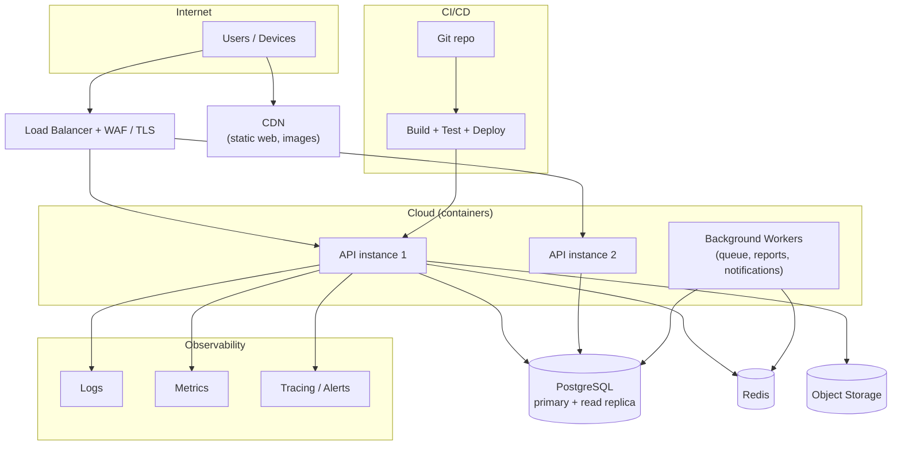

---

## 10. Mobile Evolution Path

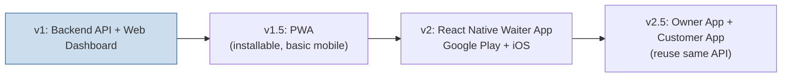

Because all logic lives in the API, each mobile app is an additive UI project, not a rewrite.

---

## 11. Roadmap Timeline (Gantt)

> Indicative durations — adjust to your team size.

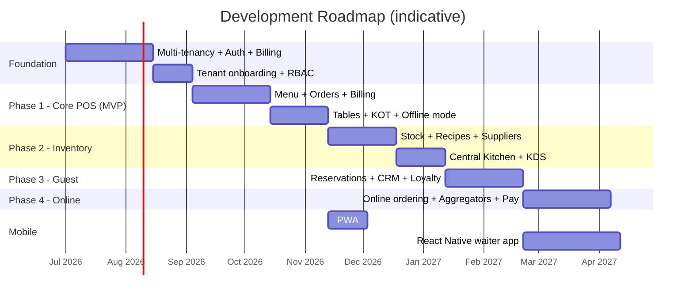

---

## 12. Tenant Onboarding State Machine

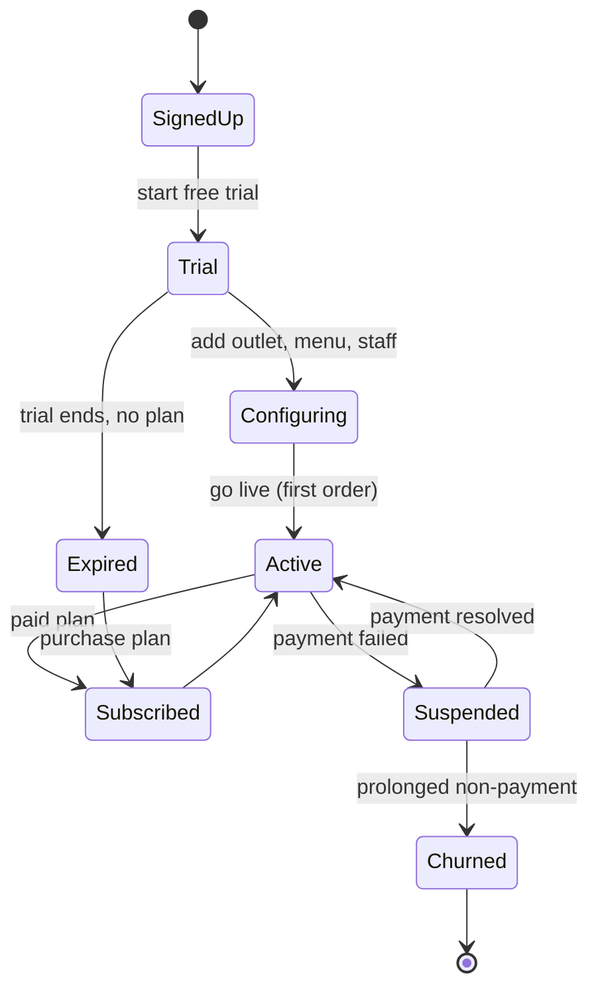

---

## How to edit these diagrams
- Each diagram is a Mermaid code block. Edit the text and the preview updates.
- Mermaid docs: https://mermaid.js.org/
- Keep this file in sync with `SOURCE_OF_TRUTH.md` when decisions change.
