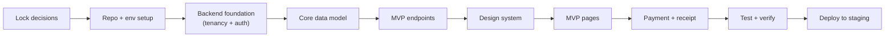

# Development Start Checklist

> Companion to all planning docs. A sequenced, actionable checklist to go from zero to a working MVP.
> Order matters: each stage unblocks the next. Check items off as you complete them.
> Last updated: 2026-06-18

## How to read this
- Stages are ordered. Finish (or mostly finish) a stage before moving on.
- **MVP target** = Foundation (P0) + Core POS (P1) from `SOURCE_OF_TRUTH.md`.
- Reference docs: `SOURCE_OF_TRUTH.md` (decisions), `ARCHITECTURE.md` (diagrams), `FRONTEND_PAGES.md` (screens), `ONBOARDING.md` (signup flow), `FRONTEND_DESIGN_SYSTEM.md` (UI).

---

## Stage 0 — Decisions to lock before coding
> These are open questions from the planning docs. Locking them prevents rework.
> **Locked with recommended defaults on 2026-06-18** to begin development. Items marked (confirm) can be revised by the owner.

- [x] Target market / first region — **region-agnostic core**; tax engine supports GST/VAT generically; payment gateway abstracted with Stripe + Razorpay adapters *(confirm primary region)*
- [x] Multi-tenancy model — **shared DB + tenant_id** (with Postgres Row-Level Security as safety net)
- [x] Backend stack — **Node.js + NestJS + TypeScript**
- [x] Frontend stack — **React + TypeScript, Next.js (dashboard/marketing) + Vite (POS/KDS), Tailwind, shadcn/ui**
- [x] Database — **PostgreSQL + Prisma ORM**; **Redis** for cache/queues
- [x] Pricing model — **per-outlet tiered plans, 14-day free trial** *(confirm tiers & prices)*
- [x] MVP feature cut — confirmed **~22 MVP pages** from `FRONTEND_PAGES.md` (P0 + P1)
- [x] Design — use documented token palette & Inter font, **code directly with shadcn/ui** (AI drafts optional)
- [x] Dark mode — **deferred to post-MVP** (tokens structured to support it later)

### Decisions Log (chosen defaults)
| Decision | Choice | Status |
|----------|--------|--------|
| Monorepo tooling | pnpm workspaces | Locked |
| Backend | NestJS + TypeScript | Locked |
| ORM / DB | Prisma + PostgreSQL | Locked |
| Cache/Queue | Redis | Locked |
| Multi-tenancy | Shared DB + tenant_id + RLS | Locked |
| Auth | JWT (access+refresh), argon2 hashing | Locked |
| Frontend | React/TS, Next.js + Vite, Tailwind, shadcn/ui | Locked |
| Primary region | Region-agnostic; confirm later | Provisional |
| Pricing tiers | Per-outlet, 14-day trial; confirm numbers | Provisional |
| Dark mode | Post-MVP | Locked |

---

## Stage 1 — Project & environment setup
- [x] Create Git repository (decide mono-repo vs separate backend/frontend repos) — **pnpm monorepo**
- [x] Recommended: **monorepo** (pnpm workspaces) with `backend/`, `frontend/`, `shared/`
- [x] Add `.gitignore`, `.editorconfig`, `README.md`
- [x] Set up Node.js version pin (`.nvmrc`) and package manager (pnpm)
- [x] Configure linting & formatting: ESLint + Prettier
- [x] Configure TypeScript (strict mode) across backend, frontend, shared
- [x] Set up `shared/` package for types/validation (Zod schemas reused front+back)
- [x] Set up environment config strategy (`.env` files, never commit secrets)
- [x] Create `docker-compose.yml` for local PostgreSQL + Redis (both verified healthy)
- [ ] Add commit hooks (husky + lint-staged) and conventional commits (optional) — deferred

---

## Stage 2 — Backend foundation (API-first)
> See `ARCHITECTURE.md` sections 1–3.

- [x] Scaffold backend (NestJS) with modular structure (one module per domain)
- [x] Connect PostgreSQL via ORM (Prisma) + migrations setup (init migration applied)
- [x] Connect Redis (cache / queues)
- [x] Implement health-check endpoint + API versioning (`/api/v1`) — verified returns ok
- [x] Set up centralized error handling, request validation, logging
- [x] Configure OpenAPI/Swagger auto-docs (at `/api/v1/docs`)
- [ ] Set up automated tests (unit + integration) scaffold — jest configured, tests pending

### Multi-tenancy core
- [x] Add `tenant_id` to the tenant-scoped schema design
- [x] Implement tenant-scoping middleware (AsyncLocalStorage tenant context from JWT)
- [ ] (Recommended) Postgres Row-Level Security as a safety net — pending (app-layer scoping in place)
- [x] Seed a `super_admin` for the platform

### Auth & RBAC
- [x] JWT issue/verify (access + refresh tokens) — verified login → /me
- [x] Password hashing (argon2), password policy (shared Zod schema)
- [x] Email/phone OTP verification (dev: OTP logged; provider pending in Stage 7)
- [x] RBAC roles: super_admin, owner, manager, cashier, waiter, kitchen, accountant
- [x] Auth middleware: verify token, extract tenant_id, enforce role per route (guards + middleware)

---

## Stage 3 — Core data model & migrations
> See `ARCHITECTURE.md` section 4 (ER diagram).

- [x] Implement entities: Tenant, Outlet, User, Subscription
- [x] Implement: MenuCategory, MenuItem, TaxRule (modifiers stored as JSON on order items for MVP)
- [x] Implement: Table/Area, Order, OrderItem, Payment, RegisterShift
- [x] Implement: Customer (basic), AuditLog
- [x] Write migrations + seed data (demo tenant with sample menu & tables)
- [ ] Verify tenant isolation with a test (tenant A cannot read tenant B data) — pending automated test

---

## Stage 4 — Backend MVP endpoints (P0 + P1)
- [x] Auth: signup, login, verify OTP, refresh, me (logout = client token discard for now)
- [x] Staff: owner creates username/password accounts with roles (kitchen/cashier/etc.); tenant-scoped staff login via subdomain+username
- [x] Onboarding: create tenant, create outlet, set localization/tax, seed menu/tables (see `ONBOARDING.md`)
- [ ] Tenants/Outlets CRUD — partial (created via onboarding; standalone CRUD pending)
- [x] Menu: categories & items CRUD, availability toggle
- [x] Tables/floor: CRUD + status
- [x] Orders: create, add/update items, send KOT, list, detail, status transitions (validated lifecycle)
- [x] Checkout: apply discount, payments, split bill, finalize (frees table) — receipt data via order detail
- [x] Register/shift: open/close, cash reconciliation
- [x] Subscriptions: plan/trial basics (read current + change plan)
- [ ] Write tests for each endpoint group — verified via manual smoke tests; automated tests pending

---

## Stage 5 — Design system & shared UI
> See `FRONTEND_DESIGN_SYSTEM.md` Parts C–E. Do this before building pages.

- [ ] Scaffold frontend app(s): dashboard (Next.js), POS/KDS (Vite SPA)
- [ ] Configure Tailwind with design tokens (colors, typography, spacing, radius, shadows)
- [ ] Install shadcn/ui + lucide-react; set theme (light; dark optional)
- [ ] Build primitives: Button, Input, Select, Checkbox/Radio/Switch, Badge, Avatar
- [ ] Build composites: DataTable, Form (RHF+Zod), Modal/Drawer, Tabs, Toast, Dropdown, DatePicker, EmptyState/Skeleton, Chart widgets
- [ ] Build layouts: dashboard app shell (top bar + sidebar + outlet switcher), POS shell (touch-first), KDS shell, public shell
- [ ] Set up API client (TanStack Query) + auth context + role-aware rendering
- [ ] Set up routing, i18n scaffold, error boundaries

---

## Stage 6 — Frontend MVP pages (~22 pages)
> See `FRONTEND_PAGES.md` MVP set.

### Public / Onboarding
- [ ] Landing, Pricing, Signup, Login
- [ ] Onboarding wizard shell + steps (account → business → outlet → localization → menu → tables → staff → plan → finish)

### Platform Admin
- [ ] Admin Login, Tenants List, Tenant Detail

### Owner/Manager Dashboard
- [ ] Dashboard Home (stats, live orders, alerts, outlet switcher)
- [ ] Orders List + Order Detail
- [ ] Menu Categories + Menu Items
- [ ] Tables & Floor Plan
- [ ] Outlet Settings, Account/Profile, Subscription/Billing

### POS App
- [ ] POS Login/PIN, Order Screen, Checkout/Payment, Receipt, Shift/Register

### KDS
- [ ] Order Queue screen

---

## Stage 7 — Integrations (start minimal for MVP)
- [ ] One payment gateway (region-appropriate: Stripe or Razorpay)
- [ ] Receipt printing (browser print → thermal printer; abstract behind interface)
- [ ] Email/SMS for OTP & confirmations
- [ ] Defer aggregators, accounting, push notifications to post-MVP phases

---

## Stage 8 — Quality, security & verification
- [ ] Unit + integration tests passing (backend)
- [ ] Component + e2e tests (frontend: Vitest/Testing Library + Playwright)
- [ ] Tenant isolation security test (no cross-tenant data access)
- [ ] Auth/RBAC test matrix (each role sees only allowed actions)
- [ ] Input validation & sanitization on all endpoints
- [ ] Secrets in env/secret manager, not in code
- [ ] Run a full happy-path: signup → onboard → take order → pay → receipt
- [ ] Accessibility pass on core components (keyboard, contrast, ARIA)

---

## Stage 9 — DevOps & deployment
> See `ARCHITECTURE.md` section 9.

- [ ] CI pipeline: lint + test + build on every PR
- [ ] Staging environment (DB, API, web)
- [ ] Containerize backend; configure migrations on deploy
- [ ] Managed PostgreSQL + Redis; backups enabled
- [ ] CDN for frontend static assets/images; object storage for uploads
- [ ] TLS, WAF/rate limiting at the edge
- [ ] Logging, metrics, error tracking, alerts
- [ ] Deploy MVP to staging; smoke test; then production

---

## Stage 10 — Post-MVP phases (then iterate)
> From `SOURCE_OF_TRUTH.md` roadmap. Layer onto the dashboard.

- [ ] Phase 2: Inventory, recipes, suppliers, central kitchen, KDS depth
- [ ] Phase 3: Reservations, CRM, loyalty, feedback, marketing
- [ ] Phase 4: Online ordering, aggregator sync, more payments, accounting
- [ ] Phase 5: Analytics/reports depth, AI features, staff management/payroll
- [ ] Mobile: PWA → React Native waiter app → owner/customer apps

---

## Critical path (the shortest line to a usable product)

## First week suggestion (if starting now)
1. Stage 0 decisions (half day) + Stage 1 repo/env setup (1 day)
2. Stage 2 backend foundation: tenancy + auth (2–3 days)
3. Stage 3 begin core data model + migrations (overlap)
4. Stage 5 begin design tokens + a few primitives in parallel (if 2 devs)

> Tip: backend foundation and design system can progress in parallel if you have more than one developer, since they meet at Stage 6 (pages calling endpoints).
