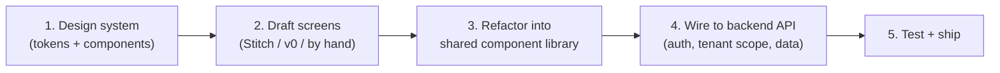
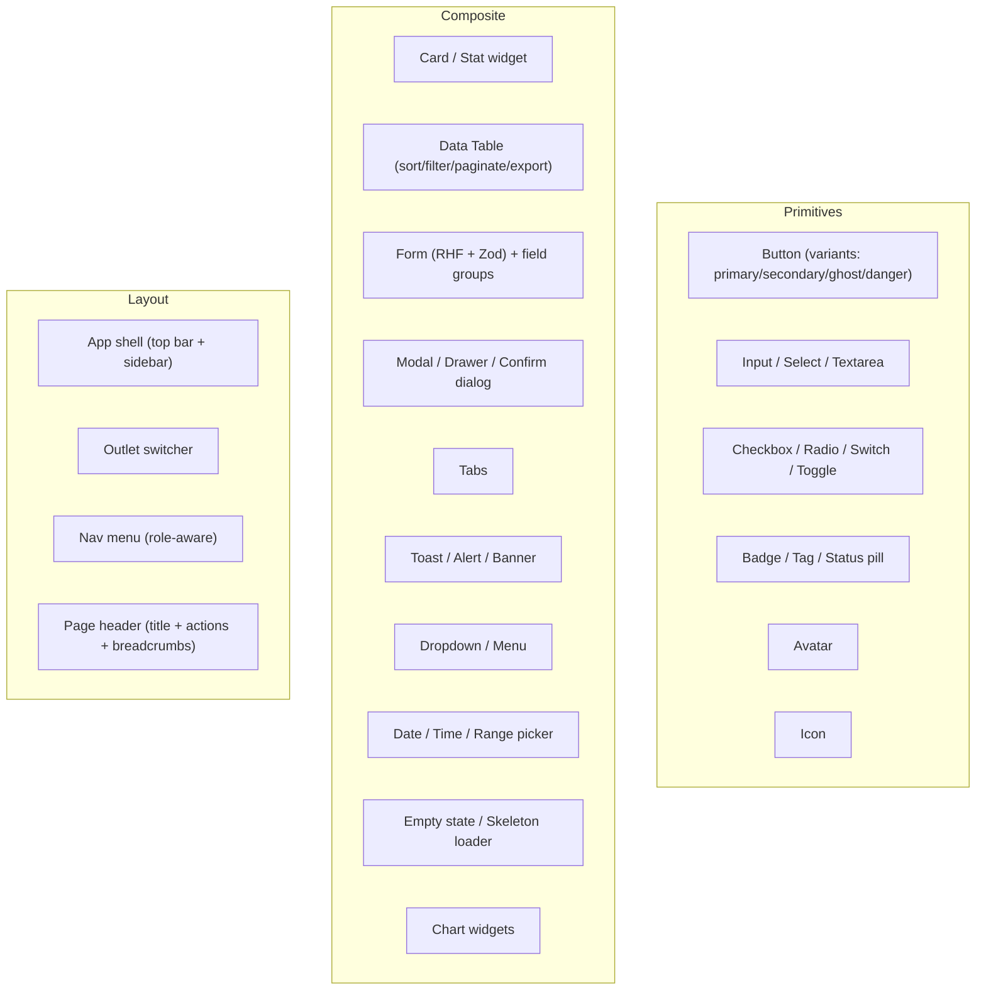

# Frontend Tooling & Design System

> Companion to `SOURCE_OF_TRUTH.md`, `ARCHITECTURE.md`, `FRONTEND_PAGES.md`, and `ONBOARDING.md`.
> Defines how we build the frontend cleanly: the tooling decision (incl. AI design tools like Stitch),
> and a concrete design system (tokens + components) that every page reuses.
> Last updated: 2026-06-18

## Why this document exists
With ~60 pages across 6 portals, the biggest risk is **inconsistency and rebuilt-from-scratch screens**.
The fix is a single design system + shared component library that every page consumes. AI design tools
speed up drafting, but the design system is the backbone that keeps everything clean and consistent.

---

## Part A — Frontend Tooling Decision

### Decision summary
- **Backbone:** A React + TypeScript component library built on **Tailwind CSS** + **shadcn/ui** (Radix primitives).
- **Design accelerators (optional):** Use **Google Stitch** and/or **Vercel v0** to draft individual screens, then refactor into our component library.
- **Rule:** AI tools draft the *look*; we build the *app* (API integration, auth/RBAC, tenant logic, offline sync). Generated code is a draft, never shipped raw.

### Role of AI design tools (Stitch / v0)
> Based on current reviews (rephrased for compliance): these tools get you roughly halfway — screens look good individually, but the design system drifts across pages and exported code isn't production-ready.

**Use them for:**
- Quick high-fidelity mockups of pages from the specs in `FRONTEND_PAGES.md`
- Exploring layout variants
- Turning sketches/screenshots into starting layouts
- A first-pass React + Tailwind scaffold for a screen

**Do not rely on them for:**
- A consistent design system across all pages (enforce ours instead)
- API integration, multi-tenant state, auth/RBAC, offline-first POS sync
- Production-ready code without refactoring

### Workflow (hybrid)


### Tool comparison
| Tool | Best for | Output | Caveat |
|------|----------|--------|--------|
| **shadcn/ui + Tailwind** | The actual production component library | React components you own | Build it once, reuse everywhere |
| **Google Stitch** | AI drafts from text/image, voice | HTML/CSS, Tailwind, React | ~halfway; refactor needed |
| **Vercel v0** | AI → React/Tailwind, shadcn output | React + shadcn/ui | Good fit since we use shadcn |
| **Figma (+ Anima)** | Proper design file first | Design + handoff code | More upfront design effort |

---

## Part B — Recommended Frontend Stack

| Concern | Choice | Notes |
|---------|--------|-------|
| Framework | **React + TypeScript** | Matches mobile path (React Native) for skill reuse |
| Build/meta-framework | **Next.js** (dashboard/marketing) or **Vite** (POS/KDS SPA) | Next.js for SEO marketing + dashboard; Vite for fast POS |
| Styling | **Tailwind CSS** | Utility-first, token-driven |
| Component library | **shadcn/ui** (Radix UI primitives) | Accessible, ownable components |
| Icons | **lucide-react** | Consistent icon set |
| State (server) | **TanStack Query** | API caching, retries, offline-friendly |
| State (client) | **Zustand** or Context | Lightweight UI/local state |
| Forms | **React Hook Form + Zod** | Validation shared with backend types |
| Charts | **Recharts** or **visx** | Dashboards & reports |
| Tables | **TanStack Table** | The shared data-table block |
| Routing | Next.js app router / React Router | Per app |
| i18n | **react-i18next** | Multi-language (tenant setting) |
| Testing | **Vitest + Testing Library + Playwright** | Unit + e2e |
| Offline (POS) | **IndexedDB (Dexie) + service worker** | Offline-first sync queue |

---

## Part C — Design System

### 1. Design tokens (single source for styling)
Define once (e.g., in Tailwind config / CSS variables); every component and AI-generated screen maps to these.

#### Color palette
| Token | Purpose | Example (light) |
|-------|---------|-----------------|
| `--color-primary` | Brand actions, primary buttons | #1F7A5A (warm green) |
| `--color-primary-fg` | Text on primary | #FFFFFF |
| `--color-accent` | Highlights, badges | #E8A33D (warm amber) |
| `--color-bg` | App background | #F7F8F7 |
| `--color-surface` | Cards, panels | #FFFFFF |
| `--color-border` | Dividers, inputs | #E2E5E2 |
| `--color-text` | Primary text | #1A1F1C |
| `--color-text-muted` | Secondary text | #6B7470 |
| `--color-success` | Confirmations | #2E9E5B |
| `--color-warning` | Low stock, attention | #E0A106 |
| `--color-danger` | Errors, destructive | #D64545 |
| `--color-info` | Info states | #3B82C4 |

> Colors above are a starting palette (cafe-warm). Adjust to final brand. Support a **dark theme** by mapping the same tokens to dark values. Tenants can also set a brand accent (used on receipts/online store).

#### Typography
| Token | Use | Value |
|-------|-----|-------|
| Font family | UI | Inter (or system UI stack) |
| Font family (mono) | Receipts, codes | JetBrains Mono / monospace |
| `text-xs` | Captions | 12px |
| `text-sm` | Body small, table cells | 14px |
| `text-base` | Body | 16px |
| `text-lg` | Subheadings | 18px |
| `text-xl`–`text-3xl` | Headings | 20–30px |
| Weights | regular 400, medium 500, semibold 600, bold 700 | |

#### Spacing & layout
- Spacing scale (Tailwind): 4px base → 1=4, 2=8, 3=12, 4=16, 6=24, 8=32...
- Container max widths; sidebar 240–280px; content gutters 16–24px
- Border radius: `sm` 6px, `md` 10px, `lg` 14px, `full` for pills
- Shadows: `sm` (cards), `md` (popovers), `lg` (modals)
- Breakpoints: `sm` 640, `md` 768, `lg` 1024, `xl` 1280 (POS/KDS target tablets; customer targets mobile)

### 2. Core components (build once, reuse on every page)


Component standards:
- **Variants & sizes** defined per component (e.g., Button: primary/secondary/ghost/danger × sm/md/lg).
- **Accessibility built in** (Radix/shadcn): keyboard nav, focus rings, ARIA, color contrast.
- **Role-aware**: components can hide/disable actions based on the user's RBAC role.
- **Themeable**: read from tokens so dark mode and tenant branding work automatically.

### 3. App-shell pattern (used by dashboard portals)
- Top bar: outlet switcher, search, notifications, profile menu
- Left sidebar: role-aware navigation grouped by module (Orders, Menu, Inventory, etc.)
- Content: page header (title + breadcrumbs + primary action) → page body
- POS & KDS use a **different, denser, touch-first shell** (big tap targets, minimal chrome)

### 4. Per-surface UX guidelines
| Surface | Priority | Guidance |
|---------|----------|----------|
| Dashboard | Density + clarity | Tables, filters, charts; desktop-first |
| POS | Speed + touch | Large buttons, few taps, offline resilient, tablet |
| KDS | Glanceability | High contrast, large text, color-coded timers |
| Customer | Simplicity + mobile | Minimal steps, mobile-first, fast load |
| Onboarding | Guidance | Progress bar, smart defaults, skippable steps |

---

## Part D — Folder Structure (frontend, suggested)
Keeps shared design system separate from per-page features.

```
frontend/
  src/
    design-system/      # tokens, theme, primitives (Button, Input, ...)
    components/         # composite shared components (DataTable, Form, Modal)
    layouts/            # app shells (dashboard, pos, kds, public)
    features/           # per-domain pages (orders/, menu/, inventory/, ...)
    lib/                # api client, auth, hooks, utils
    pages|app/          # routes
    i18n/               # translations
  tailwind.config.ts    # design tokens live here
```

---

## Part E — Build Order (clean path)
1. **Set up tokens + Tailwind config** (colors, type, spacing).
2. **Build primitives** (Button, Input, Badge, etc.) on shadcn/ui.
3. **Build composite components** (DataTable, Form, Modal, Charts).
4. **Build app shells** (dashboard, POS, KDS, public).
5. **Assemble MVP pages** (the ~22 P0+P1 pages) from components.
6. (Optional) **Use Stitch/v0** to draft a screen's look, then rebuild it with our components.
7. **Wire to backend API** with TanStack Query + auth + tenant scope.
8. **Layer phases P2–P5** onto the dashboard.

> Following this order means no page is built from scratch — every screen is assembled from the same vetted blocks, which is what keeps the project clean, consistent, and fast to extend.

---

## Decisions to confirm
- [ ] Approve stack (React/TS, Next.js + Vite, Tailwind, shadcn/ui)?
- [ ] Approve starting color palette & fonts (or provide brand)?
- [ ] Will we use Stitch/v0 for drafting, or design directly in code?
- [ ] Dark mode in MVP or later?
