# Frontend Pages & Screens

> Companion to `SOURCE_OF_TRUTH.md` and `ARCHITECTURE.md`.
> Breaks down every screen by app/portal, the features on each, and a total page count per phase.
> Last updated: 2026-06-18

Because this is a multi-tenant SaaS with different user types, the frontend is **not one app** — it's
several "portals" that all talk to the same backend API:

1. **Platform Admin Portal** — you (the SaaS owner) manage all tenants
2. **Public / Marketing site** — signup, pricing, login
3. **Owner/Manager Dashboard** — the main back-office web app each tenant uses
4. **POS App** — fast cashier/waiter billing screen (web/tablet, later React Native)
5. **Kitchen Display (KDS)** — kitchen screen
6. **Customer-facing** — online ordering + reservation + QR scan-to-order

> Legend for phase: **P0** = Foundation, **P1** = MVP, **P2** = Inventory, **P3** = Guest, **P4** = Online, **P5** = Analytics.

---

## Sitemap Overview

```mermaid
flowchart TD
    ROOT["Cafe/Restaurant SaaS"]

    ROOT --> ADM["1. Platform Admin Portal"]
    ROOT --> PUB["2. Public / Marketing"]
    ROOT --> DASH["3. Owner/Manager Dashboard"]
    ROOT --> POS["4. POS App"]
    ROOT --> KDS["5. Kitchen Display"]
    ROOT --> CUST["6. Customer-facing"]

    ADM --> ADM1["Tenants"] & ADM2["Subscriptions"] & ADM3["Platform Analytics"] & ADM4["Support/Logs"]
    PUB --> PUB1["Landing"] & PUB2["Pricing"] & PUB3["Signup"] & PUB4["Login"]
    DASH --> D1["Dashboard"] & D2["Orders"] & D3["Menu"] & D4["Tables"] & D5["Inventory"] & D6["Reservations"] & D7["Customers/CRM"] & D8["Reports"] & D9["Staff"] & D10["Settings"]
    POS --> POS1["Order Screen"] & POS2["Checkout"] & POS3["Shift/Register"]
    CUST --> C1["Menu/Order"] & C2["Cart/Pay"] & C3["Reservation"] & C4["Track Order"]
```

---

## 1. Platform Admin Portal (you, the SaaS provider)
> Phase P0. Used by `super_admin`. ~6 pages.

| # | Page | Key features |
|---|------|-------------|
| 1 | **Admin Login** | Secure login, 2FA for platform staff |
| 2 | **Tenants List** | All cafes/restaurants, search/filter, status (trial/active/suspended), create/suspend tenant |
| 3 | **Tenant Detail** | Outlets, plan, usage, billing history, impersonate (support login), activity log |
| 4 | **Subscriptions & Plans** | Define plan tiers, pricing, per-outlet limits, coupons, trials |
| 5 | **Platform Analytics** | Total tenants, MRR/churn, active outlets, growth charts |
| 6 | **Support / Audit Logs** | System logs, error monitoring, audit trail across tenants |

---

## 2. Public / Marketing Site
> Phase P0. Public, unauthenticated. ~6 pages.

| # | Page | Key features |
|---|------|-------------|
| 1 | **Landing / Home** | Value proposition, feature highlights, CTAs |
| 2 | **Features** | Detailed feature breakdown by module |
| 3 | **Pricing** | Plan comparison, per-outlet pricing, FAQ |
| 4 | **Signup / Onboarding** | Create tenant, choose plan, start trial, email verification |
| 5 | **Login** | Tenant user login, forgot/reset password, SSO (future) |
| 6 | **Contact / Demo** | Lead form, book a demo |

---

## 3. Owner/Manager Dashboard (main back-office web app)
> The largest area. Roles: owner, manager, accountant. ~30+ pages across phases.

### Core (P1)
| # | Page | Key features |
|---|------|-------------|
| 1 | **Dashboard / Home** | Today's sales, live orders, top items, low-stock alerts, quick stats, outlet switcher |
| 2 | **Orders List** | All orders (dine-in/takeaway/delivery), filters by status/date/type, search, refunds |
| 3 | **Order Detail** | Items, modifiers, KOT history, payment, customer, timeline, reprint receipt |
| 4 | **Menu — Categories** | Create/reorder categories, per-area menus, availability toggle |
| 5 | **Menu — Items** | Add/edit items, price, photos, modifiers/add-ons, tax class, mark available/sold-out |
| 6 | **Tables & Floor Plan** | Visual floor editor, areas/sections, table status (free/occupied/reserved), merge/transfer |
| 7 | **Settings — Outlet** | Outlet details, hours, currency, timezone, tax rules, receipt branding |

### Inventory & Kitchen (P2)
| # | Page | Key features |
|---|------|-------------|
| 8 | **Inventory — Stock** | Ingredient list, current stock, reorder levels, low-stock alerts |
| 9 | **Recipes** | Map ingredients to menu items (recipe-level deduction), portion sizes |
| 10 | **Suppliers** | Supplier directory, contacts, price lists |
| 11 | **Purchase Orders** | Create/track POs, receive stock, returns of damaged goods |
| 12 | **Central Kitchen** | Stock transfers between outlets, requests/supply, route plan |
| 13 | **Stock Reports** | Consumption, food cost, wastage |

### Guest & Growth (P3)
| # | Page | Key features |
|---|------|-------------|
| 14 | **Reservations Calendar** | Day/week view, floor plan availability, create/edit/cancel, waitlist, status (seated/no-show) |
| 15 | **Customers / CRM** | Guest list, profiles, visit history, preferences, tags, search |
| 16 | **Customer Detail** | Order history, spend, loyalty balance, notes, contact |
| 17 | **Loyalty Programs** | Define points rules, tiers, rewards, redemption settings |
| 18 | **Feedback / Reviews** | Collected ratings/comments, response, trends |
| 19 | **Marketing Campaigns** | Segments, SMS/WhatsApp/email campaigns, push notifications, scheduling |

### Online & Integrations (P4)
| # | Page | Key features |
|---|------|-------------|
| 20 | **Online Ordering Setup** | White-label store config, delivery zones, charges, online menu |
| 21 | **Aggregator Integrations** | Connect Zomato/Swiggy/UberEats, central menu sync, order routing |
| 22 | **Payment Settings** | Connect gateways (Stripe/Razorpay), payment methods, payout info |
| 23 | **Accounting Integrations** | Connect Tally/Zoho Books/QuickBooks, sync settings |

### Analytics & Staff (P5)
| # | Page | Key features |
|---|------|-------------|
| 24 | **Reports Home** | Report catalog, date range, outlet filter, export (PDF/CSV) |
| 25 | **Sales Reports** | By day/item/category/payment mode, trends, comparisons |
| 26 | **Inventory Reports** | Stock value, consumption, variance |
| 27 | **Staff Performance** | Sales per staff, hours, tips |
| 28 | **Multi-Outlet Dashboard** | All outlets on one screen, consolidated + per-outlet |
| 29 | **Staff Management** | Add/edit users, roles/permissions (RBAC), attendance, shifts |
| 30 | **Payroll Basics** | Wages, tips, simple payroll export |

### Account/Platform (P0/P1)
| # | Page | Key features |
|---|------|-------------|
| 31 | **Settings — Account/Profile** | Personal profile, password, 2FA, language |
| 32 | **Settings — Subscription/Billing** | Current plan, invoices, payment method, upgrade/downgrade |
| 33 | **Settings — Notifications** | Channels, templates, device tokens |
| 34 | **Audit Log** | Tenant-level activity history |

---

## 4. POS App (cashier / waiter — speed-optimized)
> Phase P1. Web/tablet first, later React Native. ~5 screens.

| # | Screen | Key features |
|---|--------|-------------|
| 1 | **POS Login / Pin** | Quick staff PIN login, shift selection |
| 2 | **Order Screen** | Menu grid by category, modifiers, table/order-type select, running cart, KOT send, split/merge |
| 3 | **Checkout / Payment** | Bill summary, discounts/coupons, multiple payment modes, split bill, tips |
| 4 | **Receipt** | Print + digital (QR/SMS/email) |
| 5 | **Shift / Register** | Open/close register, cash reconciliation, day summary |

---

## 5. Kitchen Display (KDS)
> Phase P1/P2. Kitchen screen. ~2 screens.

| # | Screen | Key features |
|---|--------|-------------|
| 1 | **Order Queue** | Incoming KOTs as tickets, time-since-order, color by urgency, mark preparing/ready, bump |
| 2 | **KDS Settings** | Station routing (e.g., bar vs grill), display preferences |

---

## 6. Customer-Facing (guests)
> Phases P3–P4. Web + later mobile. ~7 pages.

| # | Page | Key features |
|---|------|-------------|
| 1 | **QR Scan-to-Order / Menu** | Scan table QR, browse menu, add to cart, modifiers, place order |
| 2 | **Cart & Checkout** | Review order, pay online (scan & pay), order notes |
| 3 | **Order Tracking** | Live status (received/preparing/ready/served) |
| 4 | **Reservation Booking** | Pick date/time/party size, confirm, Google Reservations entry point |
| 5 | **Reservation Confirmation** | Details, add to calendar, modify/cancel |
| 6 | **Feedback** | Post-visit rating & comments |
| 7 | **Loyalty / Account** | Points balance, rewards, past orders (optional login) |

---

## Page Count Summary

| Portal | Pages | Phase span |
|--------|------:|-----------|
| Platform Admin | 6 | P0 |
| Public / Marketing | 6 | P0 |
| Owner/Manager Dashboard | 34 | P0–P5 |
| POS App | 5 | P1 |
| Kitchen Display (KDS) | 2 | P1–P2 |
| Customer-facing | 7 | P3–P4 |
| **Total** | **~60** | — |

### Minimum to launch (MVP, P0 + P1 only)
Roughly **~22 pages**:
- Public: Landing, Pricing, Signup, Login (4)
- Admin: Login, Tenants List, Tenant Detail (3)
- Dashboard: Home, Orders List, Order Detail, Menu Categories, Menu Items, Tables/Floor, Outlet Settings, Account, Subscription/Billing (9)
- POS: Login/Pin, Order Screen, Checkout, Receipt, Shift/Register (5)
- KDS: Order Queue (1)

> Build the MVP set first, then layer phases P2–P5 onto the dashboard.

---

## Shared UI building blocks (build once, reuse everywhere)
- App shell: top bar (outlet switcher, profile, notifications), sidebar nav
- Data table component (sort/filter/paginate/export) — used by orders, customers, inventory, reports
- Form components with validation
- Modal/drawer for create/edit flows
- Charts/widgets for dashboards & reports
- Empty states, loading skeletons, toasts/alerts
- Role-aware rendering (hide actions the user's role can't perform)
- Responsive layout (tablet for POS/KDS, desktop for dashboard, mobile for customer)

---

## Notes for clean development
- Keep all pages as **API clients** — no business logic in the UI (matches `ARCHITECTURE.md`).
- Reuse the shared building blocks above to avoid rebuilding tables/forms per page.
- Gate every page and action by role (RBAC) and tenant scope.
- Design POS and KDS for **touch + speed**; design the dashboard for **density + reporting**.
- Mark each page with its phase so the build order stays clear.
