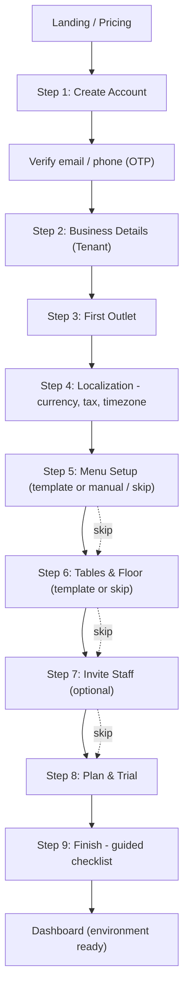
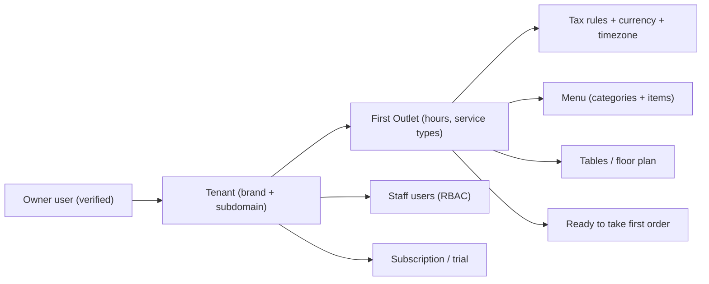

# First-Time Signup & Onboarding Wizard

> Companion to `SOURCE_OF_TRUTH.md`, `ARCHITECTURE.md`, and `FRONTEND_PAGES.md`.
> Defines the first-time experience that collects owner + cafe information and **auto-configures their environment**
> so they can start taking orders fast.
> Last updated: 2026-06-18

## Goal
When a new owner signs up, we don't drop them into an empty dashboard. We run a **guided setup wizard** that
collects just enough to provision a working environment: their account, the business (tenant), the first outlet,
taxes/currency, a starter menu, tables, and staff. Each answer configures a real part of the system.

Design principles:
- **Progressive, not overwhelming** — short steps, a progress bar, "skip for now" on non-essentials.
- **Smart defaults** — pre-fill currency/tax/timezone from country; offer menu/table templates.
- **Provision as you go** — each completed step writes real config (creates tenant, outlet, tax rules, etc.).
- **Resumable** — if they leave, they return to where they stopped (ties to the onboarding state machine).
- **Fast to value** — they can reach "take first order" in minutes; advanced setup can wait.

---

## Onboarding Flow

---

## Step-by-Step Detail

### Step 1 — Create Account (owner identity)
**Collects:**
- Full name
- Email (login)
- Mobile number (with country code)
- Password (strength rules) / or social/Google signup
- Accept terms & privacy

**Provisions / configures:**
- Creates the **owner `user`** record
- Sends email/SMS **OTP verification**
- Starts the tenant in `SignedUp` state (see onboarding state machine)

**Validation:** unique email, valid phone, password policy, verified before continuing.

---

### Step 2 — Business Details (the Tenant)
**Collects:**
- Business / brand name (e.g., "Brew & Bite Cafe")
- Business type: Cafe / Fine-dine / QSR / Bar / Cloud kitchen / Bakery (drives templates & defaults)
- Number of outlets (single vs multi-outlet) — sets expectation, not a hard limit
- Country (key — drives currency, tax, date format, aggregators, payment options)
- Preferred subdomain / workspace name (e.g., brewbite) — with availability check
- Business logo (optional, for receipts & branding)

**Provisions / configures:**
- Creates the **`tenant`** with subdomain
- Sets country-based defaults to pre-fill later steps
- Applies business-type template profile (menu/table/report presets)

---

### Step 3 — First Outlet
**Collects:**
- Outlet name (e.g., "Main Branch")
- Address (street, city, state, postal code)
- Contact phone / email for the outlet
- Operating hours (per day, with closed days)
- Service types offered: Dine-in / Takeaway / Delivery (toggles relevant features)
- Seating capacity (rough) — informs table setup

**Provisions / configures:**
- Creates the first **`outlet`** under the tenant
- Enables only the order types they selected (keeps UI lean)
- Sets hours used for reservations & reporting

---

### Step 4 — Localization (currency, tax, timezone)
**Collects (pre-filled from country, editable):**
- Currency & symbol
- Timezone
- Tax model: e.g., GST (India), VAT, Sales Tax — name, rate(s), inclusive vs exclusive
- Tax registration number (GSTIN/VAT ID) — optional, prints on bills
- Receipt language & number format

**Provisions / configures:**
- Creates **tax rule(s)** applied to menu items and bills
- Sets currency/timezone on the outlet for accurate billing & reports
- Configures receipt header/footer with legal/tax info

**Why it matters:** correct tax setup now prevents wrong bills later. This is the most country-sensitive step.

---

### Step 5 — Menu Setup
**Options:**
- **Use a template** for their business type (e.g., Cafe template: Coffee, Tea, Snacks, Desserts with sample items) — fastest
- **Import** from CSV/spreadsheet
- **Add manually** (a few items to start)
- **Skip for now** (set up later in dashboard)

**Collects (if manual/template-edit):**
- Categories
- Items: name, price, optional photo, veg/non-veg flag, tax class, modifiers/add-ons

**Provisions / configures:**
- Creates **menu categories & items** so POS has something to sell immediately
- Links items to the tax rule from Step 4

---

### Step 6 — Tables & Floor (dine-in only)
> Shown only if "Dine-in" was selected in Step 3.

**Options:**
- Quick setup: "How many tables?" → auto-generate (T1..Tn)
- Template floor plan by business type
- Define areas/sections (e.g., Indoor, Outdoor, AC) — optional
- Skip for now

**Provisions / configures:**
- Creates **tables** (and areas) used by POS, floor plan, and reservations

---

### Step 7 — Invite Staff (optional)
**Collects:**
- Team members: name, email/phone, role (manager / cashier / waiter / kitchen / accountant)
- Optional POS PIN for quick login

**Provisions / configures:**
- Creates **`user`** records with RBAC roles scoped to this tenant/outlet
- Sends invite emails; staff set their own passwords

---

### Step 8 — Plan & Trial
**Collects:**
- Plan selection (or auto-start free trial)
- Billing cycle (monthly/annual)
- Payment method (can defer until trial ends)

**Provisions / configures:**
- Creates **`subscription`** (Trial or paid)
- Moves tenant toward `Active` / `Subscribed` state
- Sets per-outlet/plan limits

---

### Step 9 — Finish: Guided Checklist
A "you're ready" screen plus a **getting-started checklist** that links back to anything skipped:

- [ ] Verify business details
- [ ] Complete menu
- [ ] Set up tables
- [ ] Invite staff
- [ ] Connect payment gateway
- [ ] Configure printer / KDS
- [ ] Place a test order

**Provisions / configures:**
- Marks onboarding complete; tenant becomes `Active`
- Lands owner on the **Dashboard** with sample/empty states guiding next actions

---

## What gets created by the end (environment summary)

---

## Field-to-Configuration Map (quick reference)

| Step | Field | Configures |
|------|-------|-----------|
| 1 | Email/phone/password | Owner login + verification |
| 2 | Business type | Templates, default features |
| 2 | Country | Currency, tax model, date format, aggregators |
| 2 | Subdomain | Tenant workspace URL |
| 3 | Service types | Which order-type features are enabled |
| 3 | Operating hours | Reservations + reporting windows |
| 4 | Tax model + rate | Bill calculation, receipt legal info |
| 4 | Currency/timezone | Billing, reports, timestamps |
| 5 | Menu items | POS catalog |
| 6 | Tables/areas | Floor plan, POS, reservations |
| 7 | Staff + roles | RBAC access |
| 8 | Plan | Limits, billing |

---

## UX & Edge-Case Notes
- **Save progress every step** — resumable onboarding (state machine: SignedUp → Trial → Configuring → Active).
- **Skippable steps** (menu, tables, staff, payment) so owners reach value fast; surface them again in the checklist.
- **Smart defaults** reduce typing; everything editable later in Settings.
- **Multi-outlet:** wizard sets up the first outlet; add more later via a shorter "Add Outlet" flow that reuses tenant-level settings.
- **Validation & security:** verify email/phone, enforce password policy, check subdomain availability, sanitize tax IDs.
- **Empty-state guidance** on the dashboard for anything skipped (e.g., "Add your first menu item").
- **Mobile-friendly:** wizard should work on phone/tablet since some owners sign up on mobile.

---

## Pages this adds to the frontend
These map into the **Public / Onboarding** area of `FRONTEND_PAGES.md`:

| # | Page/Screen | Notes |
|---|-------------|-------|
| 1 | Create Account | Step 1 + OTP verify |
| 2 | Onboarding Wizard shell | Hosts Steps 2–8 with progress bar |
| 3 | Business Details | Step 2 |
| 4 | Outlet Setup | Step 3 |
| 5 | Localization & Tax | Step 4 |
| 6 | Menu Setup | Step 5 (template/import/manual) |
| 7 | Tables & Floor | Step 6 |
| 8 | Invite Staff | Step 7 |
| 9 | Plan & Trial | Step 8 |
| 10 | Finish / Checklist | Step 9 |
| 11 | Add Outlet (later) | Short reusable flow for multi-outlet |

> ~10–11 onboarding screens (wizard steps can share one shell component, so build effort is lower than the count suggests).
