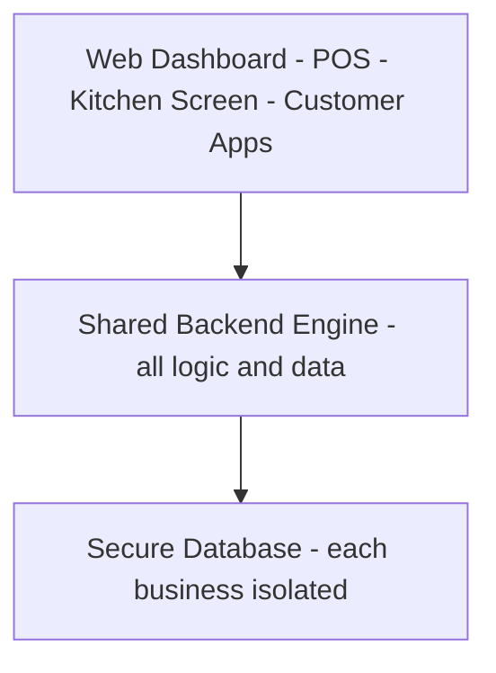

# Project Overview — Cafe & Restaurant Management System

**Prepared for:** Project Manager
**Date:** 2026-06-18
**Status:** Planning complete, ready to start development

---

## What we are building

A cloud-based (SaaS) management platform that **any cafe or restaurant owner can sign up for and use to run their business** — taking orders, billing, managing menus, inventory, reservations, and customers, all in one place.

It is **multi-tenant**, meaning a single system serves many businesses at once, each with their own private, secure workspace. One platform, thousands of potential customers.

---

## The problem we are solving

Restaurant owners today juggle multiple disconnected tools, or pay for expensive systems where key features (reservations, loyalty, marketing) cost extra. Existing players each have gaps:

| Competitor | Strong at | Weak at |
|------------|-----------|---------|
| Petpooja | Operations & reporting depth | Reservations/marketing are paid add-ons |
| LimeTray | Marketing & retention | — |
| EatApp | Reservations & guest experience | No full POS/billing |
| Zoho | Flexible, big ecosystem | Not restaurant-specific |

**Our opportunity:** combine strong operations + reservations + customer loyalty + a modern, easy interface, at an affordable price for small and independent cafes — something no single competitor offers today.

---

## Who uses it

- **Cafe/Restaurant Owners & Managers** — run the business from a dashboard
- **Cashiers & Waiters** — take orders and bill quickly (POS)
- **Kitchen Staff** — see and manage orders on a kitchen screen
- **Customers/Guests** — order via QR code, book tables, earn loyalty points
- **Us (platform team)** — manage all subscribed businesses

---

## What it does (core capabilities)

- **Point of Sale (POS) & Billing** — fast order taking, split bills, discounts, multiple payment methods, works even when the internet drops
- **Menu Management** — categories, items, prices, photos, add-ons
- **Table & Floor Management** — visual floor plan, table status
- **Inventory & Kitchen** — stock tracking, low-stock alerts, suppliers, kitchen display
- **Reservations** — online table booking and waitlist
- **Customer CRM & Loyalty** — guest profiles, points, feedback
- **Online Ordering & Delivery** — own ordering page + delivery app integrations
- **Reports & Analytics** — sales, inventory, and staff insights across outlets
- **Multi-Outlet Support** — manage several branches from one account

---

## How customers get started

New owners go through a **simple guided setup wizard** that collects their business details and **automatically configures their environment** — business info, first outlet, taxes/currency, a starter menu, tables, and staff. They can be taking their first order within minutes.

---

## How it is built (in plain terms)

- **One shared "engine" (backend)** holds all the business logic and data securely, with each business fully isolated from others.
- **Multiple "front doors" (apps)** connect to that engine: a web dashboard, a POS screen, a kitchen screen, and customer-facing pages.
- **Built API-first**, so we can add **mobile apps for Android and iOS in later versions without rebuilding** — just new screens on the same engine.

---

## Delivery plan (phased)

| Version | What ships | Focus |
|---------|------------|-------|
| **v1 (MVP)** | Signup/onboarding, POS & billing, menu, tables, basic reports | Get businesses operating |
| **v2** | Inventory, kitchen display, reservations, CRM & loyalty | Depth & retention |
| **v3** | Online ordering, delivery app integrations, payments, accounting | Growth & reach |
| **v4** | Advanced analytics, AI insights, mobile apps (Android & iOS) | Scale & differentiation |

We build the **Minimum Viable Product (MVP) first** — roughly 22 core screens — then layer on the rest phase by phase.

---

## Scope at a glance

- **~60 screens** total across all apps and phases
- **~22 screens** for the first launchable version (MVP)
- **6 user-facing areas:** admin portal, marketing site, owner dashboard, POS, kitchen display, customer apps

---

## What makes us competitive

1. **Reliable offline POS** — keeps working when the internet doesn't
2. **Reservations, CRM & loyalty included** — not charged as extras
3. **Modern, easy-to-use interface** with quick onboarding
4. **Affordable, transparent pricing** aimed at small and independent cafes
5. **Mobile-ready foundation** — apps can follow without a rebuild

---

## Current status & next step

Planning is complete. Detailed documents exist for architecture, screens, onboarding, design system, and a full development checklist (see the `planning/` folder).

**Immediate next step:** confirm a few key decisions (target region, pricing, technology choices) and begin development of the MVP backend and core screens.

---

*Detailed references: `SOURCE_OF_TRUTH.md` (master plan), `ARCHITECTURE.md` (technical design), `FRONTEND_PAGES.md` (all screens), `ONBOARDING.md` (signup flow), `FRONTEND_DESIGN_SYSTEM.md` (UI standards), `DEVELOPMENT_CHECKLIST.md` (build plan).*
